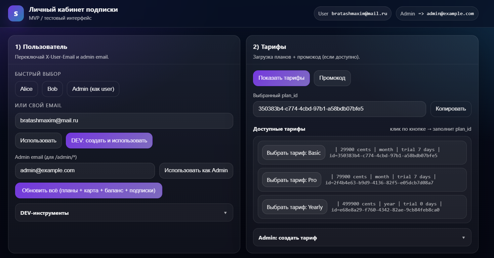
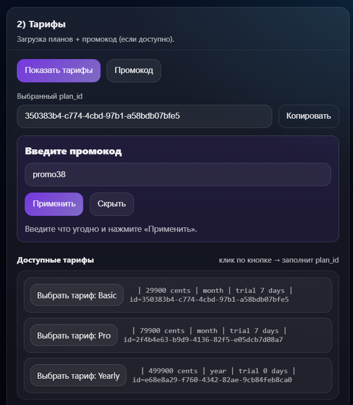
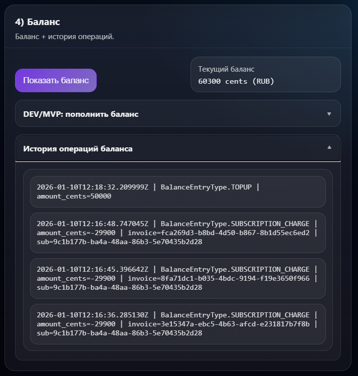
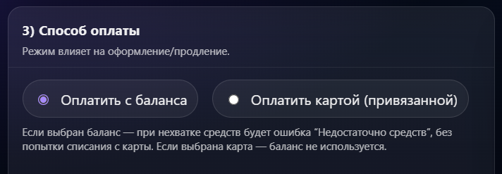
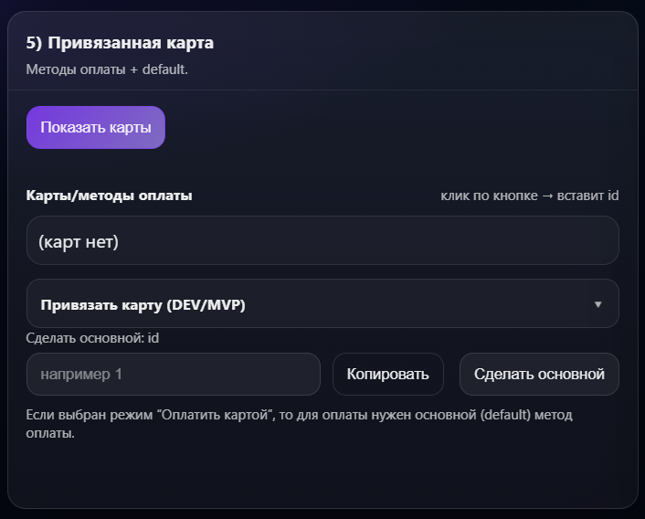
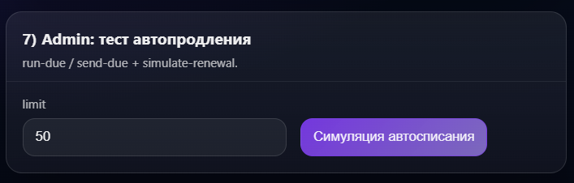

# Subscription Billing Service

Мини-сервис подписок с кошельком (balance ledger), авто-списаниями, ретраями платежей, уведомлениями (email/in-app) и scheduled задачами через Celery.

---

## Возможности

### Подписки
- Создание подписки с учётом **trial только 1 раз на аккаунт** (`User.trial_used_at`)
- Статусы подписки: `TRIAL / ACTIVE / PAST_DUE / CANCELED / EXPIRED` (и переходы по времени)   
- Отмена:
  - **Cancel at period end**: подписка работает до конца оплаченного периода, затем становится `EXPIRED`   
  - **Cancel immediately**: мгновенная отмена (`CANCELED`)

### Биллинг и платежи
- Авто-списания по подписке (проверка “due”, создание invoice/transaction, попытка charge)   
- **Idempotency keys** на списания/инвойсы/транзакции, включая ключ по периоду (`period_key`)
- Ретраи платежей при временной недоступности/decline (ограничение попыток + backoff)   
- Поддержка **режима оплаты**:
  - `balance` — списание с внутреннего кошелька
  - `card` — списание через payment gateway (по default payment method)   

### Кошелёк 
- Хранение баланса в `User.balance_cents` + журнал проводок `BalanceEntry`
- `credit()` / `debit_if_possible()` с блокировкой пользователя и идемпотентностью

### Уведомления
- Очередь уведомлений в БД: статус `PENDING/SENT/FAILED`, `scheduled_at`, ретраи   
- Каналы:
  - `EMAIL` (SMTP и dev-fallback печатает письмо в лог)
  - `IN_APP`  
- Throttle/anti-spam для частых `PAYMENT_FAIL` (окно 10 минут)

### Scheduled tasks (Celery)
- `billing` — каждые ~30 секунд проверяет подписки “к списанию”   
- `notifications` — каждые ~60 секунд отправляет due-уведомления   

---

## Архитектура 

- **Models** (SQLAlchemy): `User`, `Plan`, `Subscription`, `Invoice`, `Transaction`, `PaymentMethod`, `BalanceEntry`, `Notification`, `Refund` и др.
- **Services**
  - `SubscriptionService` — создание/отмена/переходы статусов
  - `BillingService` — списание, инвойсы/транзакции, ретраи, идемпотентность
  - `WalletService` — кошелёк и ledger проводок
  - `NotificationService` — enqueue + отправка SMTP + ретраи
- **Payments**
  - `PaymentGateway` (Protocol) + типовые ошибки
  - `FakePaymentGateway` (рандомизирует исходы: success/insufficient/unavailable/declined)
- **Tasks**
  - `run_billing_due` — джоба биллинга
  - `send_due_notifications` — джоба отправки уведомлений
  - Планировщик beat — в `celery_app.py`

## Быстрый старт

### Запуск через Docker

Проект полностью запускается через **Docker Compose** и не требует ручного старта сервисов.

#### Требования
- Docker ≥ 20.x  
- Docker Compose ≥ 2.x  

#### Запуск
`docker compose up -d --build`

## Демонстрация интерфейса (MVP)

### Главная страница личного кабинета
Единая точка входа в тестовый MVP-интерфейс: выбор пользователя, тарифов, способов оплаты и административных действий.

---

### Тарифы и промокоды
Просмотр доступных тарифов, выбор плана и применение промокода.

---

### Баланс и история операций
Текущий баланс пользователя и журнал всех операций (пополнение, списания по подписке).

---

### Выбор способа оплаты
Поддержка двух режимов оплаты, влияющих на биллинг и автопродление:

- **Оплата с баланса** — списание только из wallet
- **Оплата картой** — используется привязанный default payment method

---

### Привязанные карты и методы оплаты
Управление методами оплаты пользователя и выбор **default** карты для списаний.

> Если выбран режим «Оплатить картой», система использует основной (default) метод оплаты.

---

### Управление подписками
Список подписок пользователя, статусы (`active / past_due / canceled`) и периоды действия.

---

### Admin: тест автопродления
Административный инструмент для запуска:
- `run-due` — проверка подписок к списанию
- `send-due` — отправка уведомлений
- `simulate-renewal` — симуляция автопродления

Используется для тестирования scheduled-задач и edge cases.

---

### Симуляция автопродления подписки
Автоматическое продление подписки с обновлением периода и списанием средств.

---

### Лог биллинга
Результат выполнения биллинга: invoice, transaction и записи в balance ledger.

---

### Email-уведомления
Автоматические email-уведомления пользователю:
- оформление подписки
- успешная оплата
- продление подписки

---

### Примечание
Интерфейс является **тестовым mini-cabinet UI**, предназначенным для демонстрации:
- Логики подписок
- Авто-списаний и ретраев платежей
- Системы уведомлений

